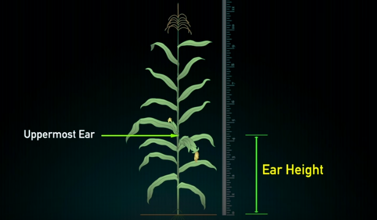
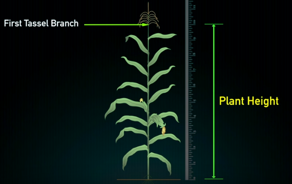
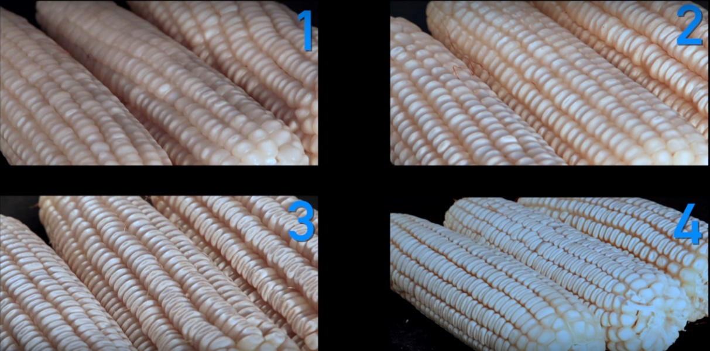

```{r setup, include=FALSE}
library(tidyverse)
require(tsibble)
library(lubridate)
require(DiagrammeR)
require(viridis)

theme_set(theme_light())
knitr::opts_chunk$set(tidy = FALSE, cache = TRUE, 
                      echo = FALSE, 
                      tidy.opts = list(width.cutoff=50), 
                      eval = TRUE, warning = FALSE, message = FALSE,
                      # fig.show = "hold", 
                      fig.align = "center", fig.width = 5,
                      fig.asp = 0.9, out.width = "0.6\\linewidth")
options(knitr.kable.NA = "", digits = 3)

def.source.hook  <- knitr::knit_hooks$get("source")
knitr::knit_hooks$set(source = function(x, options) {
  x <- def.source.hook(x, options)
  x <- ifelse(!is.null(options$linestretch), 
              paste0("\\linespread{", options$linestretch,"}\n", x, "\n\n\\linespread{", lstr,"}"), 
              x)
  ifelse(!is.null(options$size), 
         paste0("\\", options$size,"\n\n", x, "\n\n \\normalsize"), 
         x)
})
```

```{r share-legend-grid}
grid_arrange_share_legend <- function(..., nrow = 1, ncol = length(list(...)), position = c("bottom", "right")) {
  plots <- list(...)
  position <- match.arg(position)
  g <- ggplot2::ggplotGrob(plots[[1]] + ggplot2::theme(legend.position = position))$grobs
  legend <- g[[which(sapply(g, function(x) x$name) == "guide-box")]]
  lheight <- sum(legend$height)
  lwidth <- sum(legend$width)
  gl <- lapply(plots, function(x) x + theme(legend.position = "none"))
  gl <- c(gl, nrow = nrow, ncol = ncol)

  combined <- switch(position,
                     "bottom" = gridExtra::arrangeGrob(do.call(gridExtra::arrangeGrob, gl),
                                            legend,
                                            ncol = 1,
                                            heights = grid::unit.c(unit(1, "npc") - lheight, lheight)),
                     "right" = gridExtra::arrangeGrob(do.call(gridExtra::arrangeGrob, gl),
                                           legend,
                                           ncol = 2,
                                           widths = grid::unit.c(unit(1, "npc") - lwidth, lwidth)))
  grid::grid.newpage()
  grid::grid.draw(combined)
}
```


<!-- \linenumbers -->

\newpage

# Background

Maize ( _Z. mays_ L.) is a tall, monecious annual grass cultivated in \SI{956447}{\hectare} of land in Nepal fetching annual production of 2,713,635 tonnes (MoAD, 2077). It's cultivation, although a commonplace practice in Nepal, has been thriving in mostly traditional form despite claiming a major share as a staple food system. Consumption trend of Maize as of 2018 as suggested by the leading national maize research organization, NMRP, informs^[https://kathmandupost.com/money/2018/01/12/maize-output-to-hit-all-time-high-of-255-million-tonnes] that 22.52 \% of the daily cereal uptake per capita [@hirai1993food] is met with Maize. Since maize based agriculture system forms integral part of human food chain, while exhibiting prospects of continually increased contribution to dietary need supplementation, an honest step to mitigating long term food security in Nepal is investing resources to maize production and research.

A closer survey into food habit of past few years in Nepal suggests toward increasing meat consumption, especially that of poultry. Newer avenues for demand of maize as animal and poultry feed has opened. Furthermore, new types of maize-based products such as soups, vegetables and edible oils are in demand for use as food. While winter maize may be a promising technology intervention, longer growing season, extreme weather scenarios and inadequate irrigation infrastructures in major production pockets are the major hurdles to expansion of this technology.

Seasonal cultivation of maize in Nepal is generally scheduled differently for various agro-ecological zones. For instance, recommendation for optimal timing of planting in lower and higher mid-hill are is during summer second half of April/May and second half of March/April, respectively. For terai region, however, crop matures at relatively shorter growing period. Therefore, in areas with provision of proper drainage two harvests can be taken -- first planted in summer on second half of Feb/March and the second planted before onset of monsoon during second half of May/June season may.

Summer season maize plantation ensures early harvest and becomes a bridge to utilize fallow period between winter and monsoon season, the later being mostly dedicated to rice production. However, with gains come risk. Maize planted as summer crop in terai region of Nepal generally has to withstand scenario of extreme heat during vegetative-reproductive transitioning stage, unfortunately. Several studies have detailed on the ill consequences on yield components including reduced florets per ear, reduced number of viable kernel resulting due to kernel abortion, lesser silk extrusion, and reduced prolificacy of the crop that have gone through a period of high heat [@edreira2011heat]. In contrast to biomass partitioning, severe effects were noted on final kernel number due to reduced overall biomass production under high temperature regimes [@echarte2006kernel].

Effects of multifaceted events like climate change are being realized only recently in major cultivated crops including rice [@mukamuhirwa2019concurrent], lentil [@sehgal2017effects]. Recent findings concerning effects of weather extremes, particularly during late vegetative and reproductive stages of the maize have underlined mechanisms that relate metabolism of upper body of crop to be detrimentally affected causing yield reduction [@zhao2016difference; @obata2015metabolite]. Although touted a C4 plant having elaborate metabolic features that improve survival at high temperature and arid conditions, not unlike many other commercial crop maize requires a favorable growing period to realize good harvest. Shifting global climatic patterns are of major concern to countries of South Asia, notably Nepal, which traditionally have relied on low input use and mercy of good weather. As highlighted by @niyogi2015crop, current production systems are not sustainable and could be adversely impacted by extreme climate events in the near future.

Optimum yields occur when hybrids of suitable maturity duration and architecturally suited to dense population stand are chosen. In addition, exogenous sources of nitrogen fertilizer are generally applied and weed and insect control measures are generally recommended. Generally, hybrids are either early, medium or late maturing according to the amount of "heat units" that will be required for maturity.

Noting critical role of temperature regime during flowering and grain filling with heat stress causing severe reduction in economic yield [@barnabas2008effect], breeding for heat-tolerant cultivars is crucial to sustain crop production in the future. Genetic diversity analysis is imperative in crop improvement and can be studied through morphological, biochemical and molecular markers. Morphological characterization for genetic divergence among genotypes is considered an initial step [@chen2012characterization].

## Rationale

Heat stress limits the productivity of maize in several tropical macro-environments. Knowledge of the genetic diversity of maize varieties along with information about traits conferring heat stress tolerance is necessary for generating effective breeding programs.

This study aims to elucidate the mechanisms of heat tolerance under field conditions in maize and identify potential genotypic variation that could be exploited in high temperature condition of Nepal. 

Contribution of and effects on component traits in response to heat stress, differential expression of response on genotypes will be investigated in the current study. This will also extend the step of genotype characterization for more rigorous marker based genetic analysis.

# Hypothesis

Null hypothesis that there is no significant difference among Maize genotypes will be tested. Likewise, contribution of component traits with potential impact on yield will be tested with yield response regression and pathway analysis.

# Objectives

The objective of the research is to identify superior heat stress tolerant exotic hybrids for summer growth conditions in Kailali district of Nepal.

We also compare performance of national hybrids (selectively included as check) in terms of response to yield and associated components conditioned by prevailing summer heat.

# Literature review

Maize growth and development is of particular interest because of the fame it has earned as one of the important staple crops worldwide. For regions of asia where agro-ecosystems are relatively unamicable to grow rice and wheat, maize is frugally cultivated. 

Comparative phenotypic analysis of the rice and maize crops have shown that the latter only manifests mild form of temperature induced stress injury as opposed to rice, economic yield as well as phenotype of which is drastically affected when grown under similar conditions of atmospheric temperatures [@kumar2012comparative] at upper spectra than optimal. The stress injury caused significant disruption of cell membranes, loss of chlorophyll and reduction in leaf water status in rice, especially at \SIrange{40}{45}{\celsius}. Likewise, studies using genetically modified line of rice with maize transgenes have also shown that maize germplam contains a set of useful genes [@janni2020molecular] that, independent of the genomic background, confer tolerance to salt stress [@campo2012expression].

Although less severe in relation to rice, high daily temperature in maize above \SI{35}{\celsius} is known to affect all stages of vegetative and reproductive growth. Known physiological mechanisms of heat injury are alteration of membrane fluidity, onset of oxidative damage caused high respiration and photosynthetic imbalance and reduced production of antioxidants [@bita2013plant].

Although the overall utility of a maize germplasm is not only conditioned by its response to heat stress but by the quantitative measure of yield, a collection of maize hybrid germplasm, arising from distinct combinations of parental strains might, however be benefitted by genetic processes involving dominance, overdominance (biomass and vigor in cotton) or epistatis (http://www.plantphysiol.org/content/plantphysiol/168/4/1197.full.pdf) underlying a hybrid production and the presiding stages of line development [@singh2009varietal; https://bmcgenomics.biomedcentral.com/articles/10.1186/s12864-020-6561-9]. Even pleiotropic behavior of genes are reported for playing a role in producing differential expression patterns when allowed expression in different environments [@des2010pleiotropy].

Major studies elucidating molecular basis of abiotic tolerance in a a range of crops have suggest towards a rather generalized system for orchestration of stress response via pathways involving large number of genes or quantitative loci. Trascriptional regulation and epigenetic changes may be few of those [@tardieu2010dissection].


# Methodology

## Site selection

The field experiment will be conducted in the research field of Matayari, Dhangadi-6, Kailali. The field is located at $28^\circ 43' 48''$ N latitude and $80^\circ 35' 57''$ E longitude at the altitude of 188 masl. The experimental site has tropical to sub-tropical climate with hot dry summer and cold winter. An account of meteorological data for past 3 years in the study site is depicted in Figure \ref{fig:climatology-matyari-dhangadhi}.

```{r climatology-matyari-dhangadhi, fig.cap="Daily weather (precipitation and temperature) of Dhangadhi-13, Kailali during few preceeding years of study", fig.subcap=c("Cumulative monthly precipiation (from 2016 to 2019)", "Daily maximum temperature (from 2017 to 2019)"), fig.width=6, fig.height=4, out.width="0.48\\textwidth", fig.ncol = 2}

interest_params <- c("PRECTOT", "RH2M", "KT", "T2M", "T2M_MAX", "T2M_MIN", "T2MWET", "TM_ZONES", "WSC")

# # meta information about the parameters of interest
# nasapower::parameters[names(nasapower::parameters) %in% interest_params]
# nasapower::parameters[1]$ALLSKY_SFC_LW_DWN
# 
# nasapower::parameters[names(nasapower::parameters) %in% interest_params] %>% 
#   enframe() %>% 
#   mutate(sse_units = map_chr(value, ~.x[["SSE_Units"]]), 
#          community = map(value, ~.x[["community"]]), 
#          include_freq = map_chr(value, ~last(.x[["include"]]))
#   ) %>% 
#   group_by(name, sse_units) %>% 
#   unnest(cols = community) %>% 
#   ungroup() %>% 
#   distinct(name, .keep_all = TRUE)


# # download data
# dhangadhi_climatology_prectot <- nasapower::get_power(community = c("SB"),
#                                                       pars = c("PRECTOT"),
#                                                       temporal_average = "DAILY", lonlat = c(80.59952, 28.73020),
#                                                       dates = c("2016-01-01", "2019-12-31"))
# 
# dhangadhi_climatology_kt <- nasapower::get_power(community = c("SB"),
#                                                       pars = "KT",
#                                                       temporal_average = "DAILY", lonlat = c(80.59952, 28.73020),
#                                                       dates = c("2016-01-01", "2019-12-31"))
# 
# dhangadhi_climatology_rh2m <- nasapower::get_power(community = c("AG"),
#                                                    pars = "RH2M",
#                                                    temporal_average = "DAILY", lonlat = c(80.59952, 28.73020),
#                                                    dates = c("2016-01-01", "2019-12-31"))
# 
# dhangadhi_climatology_t2m <- nasapower::get_power(community = c("AG"),
#                                                   pars = "T2M",
#                                                   temporal_average = "DAILY", lonlat = c(80.59952, 28.73020),
#                                                   dates = c("2016-01-01", "2019-12-31"))
# 
# dhangadhi_climatology_t2mwet <- nasapower::get_power(community = c("AG"),
#                                                      pars = "T2MWET",
#                                                      temporal_average = "DAILY", lonlat = c(80.59952, 28.73020),
#                                                      dates = c("2016-01-01", "2019-12-31"))
# 
# dhangadhi_climatology_t2m_max <- nasapower::get_power(community = c("AG"),
#                                                       pars = "T2M_MAX",
#                                                       temporal_average = "DAILY", lonlat = c(80.59952, 28.73020),
#                                                       dates = c("2016-01-01", "2019-12-31"))
# 
# dhangadhi_climatology_t2m_min <- nasapower::get_power(community = c("AG"),
#                                                       pars = "T2M_MIN",
#                                                       temporal_average = "DAILY", lonlat = c(80.59952, 28.73020),
#                                                       dates = c("2016-01-01", "2019-12-31"))
# 
# # # throws error
# # dhangadhi_climatology_tm_zones <- nasapower::get_power(community = c("SB"),
# #                                                       pars = "TM_ZONES",
# #                                                       temporal_average = "CLIMATOLOGY",
# #                                                       lonlat = c(80.59952, 28.73020))
# 
# 
# dhangadhi_climatology_wsc <- nasapower::get_power(community = "AG",
#                                                   pars = "WS10M", # refer to inputs list
#                                                   temporal_average = "DAILY", lonlat = c(80.59952, 28.73020),
#                                                   dates = c("2016-01-01", "2019-12-31"))
# 
# dhangadhi_data_2016_19 <- mget(ls(pattern = "dhangadhi_climatology")) %>%
#   reduce(left_join)
# 
# write_csv(dhangadhi_data_2016_19, "./dhangadhi_data_2016-19.csv", "")

dhangadhi_data_2016_19 <- read_csv("./data/dhangadhi_data_2016-19.csv")

dhangadhi_tsibble <- dhangadhi_data_2016_19 %>% 
  as_tsibble(key = c(LON, LAT), index = YYYYMMDD)

dhangadhi_tsibble %>% 
  mutate(ymonth = yearmonth(YYYYMMDD)) %>% 
  index_by(ymonth) %>% 
  summarise(PRECTOT = sum(PRECTOT, na.rm = TRUE)) %>% 
  feasts::gg_season(y = PRECTOT, size = 1.2) +
  labs(x = "Month", y = "Monthly precipitation (in mm)")

# # temperature
# dhangadhi_tsibble %>% 
#   index_by(ymonth = yearmonth(YYYYMMDD)) %>% 
#   summarise(T2M = mean(T2M, na.rm = TRUE), 
#             T2M_MIN = mean(T2M_MIN, na.rm = TRUE), 
#             T2M_MAX = mean(T2M_MAX, na.rm = TRUE)) %>% 
#   as_tibble() %>% 
#   mutate(month = month(ymonth), 
#          year = year(ymonth)) %>% 
#   ggplot(aes(x = month, color = as.factor(year))) +
#   geom_line(aes(y = T2M), size = 1.4, linetype = 1) +
#   geom_line(aes(y = T2M_MIN), size = 1.2, linetype = 2) +
#   geom_line(aes(y = T2M_MAX), size = 1.2, linetype = 2) +
#   scale_color_discrete(name = "Year") +
#   scale_x_continuous(breaks = 1:12, labels = month.abb) +
#   labs(x = "Month", y = "Average monthly temperature")

gg_season_t2m_max <- dhangadhi_tsibble %>% 
  filter(year(YYYYMMDD) > "2016") %>% 
  feasts::gg_season(y = T2M_MAX, size = 1) + # labels = "right"
  labs(x = "Month", 
       y = expression("Maximum daily temperature from Jan, 2017 to Dec, 2019 "*(~degree*C))) +
  theme(legend.position = "bottom")
gg_season_t2m_max

# ggsave("./maximum_daily_temperature.png", 
#        gg_season_t2m_max, device = "png", 
#        height = 5, width = 12, dpi = 200, units = "in")

```


Selected site is expected to beneficial due to its rich soil depth and cultivation friendly profile. Although, maize crop is said to perform well on a wide range of climatic conditions, its suitability to the study site is further corroborated with the following soil textural and composition attributes.

```{r site-soil-meta-info, linestretch=1}
tribble(
  ~"Feature", ~"Condition", 
  "Soil pH", "5", 
  "Soil texture", "Clayey loam", 
  "Organic matter content", "Moderate to high", 
  "O-horizon depth", "> 15 cm", 
  "Slope", "Low with delayed drainage"
) %>% 
  knitr::kable(booktabs = TRUE)
```

For field preparation prior to planting, land will be made free of volunteer plants. Selected land will be deep ploughed twice followed by harrowing. Finally, prior to sowing rotary harrow or seed drill will be used to obtain a fine tilled bed.

```{r site-meta-info, linestretch=1}
tribble(~"Collaborator", ~"Location", ~"Coordinates", ~"Elevation", ~"Climate", 
        "Unique Seed Company Private Limited", "Dhangadhi-6 (Matyari), Kailali", "\\ang{28;43.48;}N, \\ang{80;35.57;} E", "188m", "Tropical") %>% 
  knitr::kable(booktabs = TRUE, escape = FALSE) %>% 
  kableExtra::kable_styling(latex_options = "striped", font_size = 10) %>% 
  kableExtra::column_spec(column = 1:2, width = c("10em", "10em"))
```

- 1 m distance between blocks
- Dimension: 2.5 m × 4 m
- Line sowing method: Continuous
- Randomization design: Alpha lattice
  - Number of Replication (r) = 2
  - Number of Blocks (b) = 4
  - Number of blocks per replication (s) = 2
  - Number of treatments per block (k) = 13
	
## Field design and layout

Trial was set on alpha lattice design with two replicates. Gross plot area for for each of the 52 plots was \SI{10}{\metre\squared}. 

```{r alpha-layout, message=FALSE, warning=FALSE, results='hide', fig.width=8, fig.height=5, out.width="98%"}

htma_data <- read_csv("./data/1608984316098_1607141455046_HTMA maize.csv")

# htma_data %>% 
#   select(Rep, block = Bloc, Entry, genotype) %>% count(Rep, block)
# # contains 13 balanced genotypes per block and 2 blocks in a replication

htma_design <- htma_data %>% 
  select(Rep, block = Bloc, Entry, genotype) %>% 
  group_by(block) %>% 
  mutate(cols = row_number())

myplots <- lapply(split(htma_design, htma_design$Rep), function(x){
  p1 <- ggplot(x, aes(cols, block, fill = `genotype`)) + 
    geom_tile(colour="white", size=1.5, stat="identity") + 
    scale_fill_discrete(c = 90, l = 95) +
    ggrepel::geom_text_repel(aes(cols, block, label = genotype), 
              color="black", size=rel(2.5), arrow = grid::arrow(length = unit(0.12, "inches"), angle = 18, type = "closed", ends = "first")) +
    labs(title=paste0("Replication ", unique(x$Rep)), 
         x = NULL, y = NULL) +
    coord_flip() +
    theme_bw() +
    theme(legend.position="none") + # removes all legend
    theme(axis.title.y = element_blank(),
         axis.text.y = element_blank(),
         axis.ticks = element_blank(), 
         plot.title = element_text(color = "darkblue", size = 10, hjust = 0.5))
}
)

alpha_des_20_book_gg <- do.call(gridExtra::grid.arrange,c(myplots, ncol=2))

# m_gen <- c(paste0("Genotype ", 1:18), "Check 1", "Check 2")
# alpha_des_20 <- agricolae::design.alpha(trt = m_gen, k = 4, r = 2, seed = 2020, randomization = TRUE)
# 
# alpha_des_20_book <- alpha_des_20$book %>% 
#   as_tibble()
# 
# myplots <- lapply(split(alpha_des_20_book, alpha_des_20_book$replication), function(x){
#   p1 <- ggplot(x, aes(cols, block, fill = `m_gen`)) + 
#     geom_tile(colour="white", size=1.5, stat="identity") + 
#     scale_fill_discrete(c = 90, l = 95) +
#     geom_text(aes(cols, block, label = m_gen), 
#               color="black", size=rel(2.5)) +
#     labs(title=paste0("Replication ", unique(x$replication))) +
#     theme_bw() +
#     theme(legend.position="none") + # removes all legend
#    theme(axis.title.y = element_blank(),
#          axis.text.y = element_blank(),
#          axis.ticks = element_blank(), 
#          plot.title = element_text(color = "darkblue", size = 10, hjust = 0.5))
# }
# )
# 
# alpha_des_20_book_gg <- do.call(gridExtra::grid.arrange,c(myplots, ncol=2))
# 
# ggsave("./rice_genotype_trial_baitadi_2019.png", plot = alpha_des_20_book_design, 
#        width = 8, height = 6, units = "in", dpi = 250)
```


## Interculture management

Spacing: Row to row \SI{60}{\centi\metre} and plant to plant \SIrange{20}{25}{\centi\metre}.

Fertilizer: Maize hybrids are responsive to nutrients applied either through organic or inorganic sources. The rate of nutrient application depends mainly on soil nutrient status/balance and cropping system. For obtaining desirable yield 180:60:40 kg NPK/ha with minimum 2 split dose of nitrogen should be followed. As the number of split of N increase the crop yield will increase accordingly.

Weeding: two hand weeding at 20 to 25 days after sowing and 40 to 45 days of sowing is necessary to control weed. Atrazine 1 to 2 manual weeding was followed as according to field condition. Pre-emergence application of Atrazine at the rate of \SIrange{1.0}{1.5}{\kg AI \per\hectare} in \SI{600}{\liter} water will be very effective in control of wide range of annual and broad leaf weeds.

Irrigation: Sufficient moisture should be available in soil during seed sowing, if not immediate irrigation should be given. Irrigation should be followed as according to the soil and climatic condition.

## Data collection method

Data collection was followed as according to CIMMYT field book, days to flower (male and female), plant height, ear height, field weight, moisture, cob aspect and plant aspect were mainly considered. 

## Observations

1. Days to Male Flowering: Record number of days from seed sowing to date of flowering of tassel (pollen shedding) in 50\% of plants in plot. 

2. Days to Female Flowering: Record number of days from seed sowing to date of appearance of silk in 50\% of plants in plot. 

3. Anthesis Silking interval (ASI): It is the difference of days from female flowering to the male flowering.

4. Plant height: It is the height of plant from base of the plant to the base of lower tassel branch. It should be collected form minimum 5 representative plants from plot.

5. Ear height: Height from base of the plant to the base of top most cob.

```{r maize-ear-height, fig.cap="Recording heights in Maize", fig.subcap=c("Ear height", "Plant height"), fig.align='center', out.width="0.48\\textwidth"}


```

6. Field weight: Total weight of the dehusked cob during harvesting at field.

7. Number of plant and cob: Count the number of plants in whole plot during harvesting and total number of cobs from whole plot. It will help to find the prolifically and barren plants in plot.

8. Cob length: It is the length of cob from base to the tip of cob.

9. Cob circumference: It is the girth of the average sampled 5 cobs from middle part of cob. Cob diameter can also be measured by using vernier caliper from middle portion of cob.

<!-- ```{r maize-cob-length-diameter, fig.cap="Measurement of cob diameter and cob length"} -->
<!-- knitr::include_graphics(c("./images/maize_cob_diameter.png",  -->
<!--                         "./images/maize_cob_length.png")) -->
<!-- ``` -->

10. Number of rows per cob: It is the number of rows presented in average sampled cob.

11. Number of grain per row: It is average number of grains presented in rows from sampled cobs.

12. Lodging: Number of plants fallen in ground should be counted. Plants fall from stem below cob are considered as stem lodging and if plants fall from ground (root) are counted as rood lodging.

13. Moisture: Several sampled cobs were selected and grain from middle portion of cob was taken at the time of harvesting when field weight is taken. Moisture was converted into 12.5% for final data analysis.

14. Plant aspect: Complete visual score given by breeder to the overall plant performance of a variety. It incorporate major traits such as:
- Ear position
- Plant architecture
- Tassel characteristics
- Disease prevalence

It is recorded prior to the onset of crop senescence. It is scored from 1 to 5 scale;
- 1 represent excellent plant type, good yield potential, crop uniformity, lower ear position, vigorous, good stalk strength. 
- 5 represent poor plant type, low yield, lodging, diseased, discoloured leaves and poor tassel exertion.

15. Ear aspect: Ear aspect id the composite visual score given by breeders to the overall yield performance of the variety. It include key traits such as:
  - Yield
  - Ear rot
  - Texture
  - Ear uniformity
  - Grain filling
  - Cob covering
  - Ear symmetry

It is recorded just after cob harvesting and scored as 1 to 5:
- 1 represent excellent ear type, flint texture, disease free, large straight uniform rows.
- 5 represent poor ear type, small, rotten, non-uniform rows.

16. Texture: maize grains can be differentiated into 4 texture group on the basis of their grain appearance:
  - 1: flint,
  - 2: semi flint,
  - 3: semi dent
  - 4: dent

```{r maize-texture, fig.cap="Scoring of grain texture in maize"}

```

Grain texture is recorded at harvest from all entry of trials.

## Data analysis

Field observation data will be recorded in a field book for standing crop, soil parameters and post-harvest crop attributes. The field book will be transcribed to a database sheet, possibly using MSExcel software. Exploratory as well as inferential analysis will be carried out using open source application META-R.

# Deliverables

# Expected outcomes

# Timeline

- Project started: March 1, 2020
- Project end: February 28, 2021


```{r timeline, fig.width=8, fig.height=8, out.width="0.75\\textwidth", fig.cap="Gantt chart of research showing estimated time periods for each activity", fig.pos="H"}
htma_gantt_outline <- read_csv("./data/gantt_timeline.csv") %>% 
  mutate(activity_id = paste0("task_", row_number())) %>% 
  mutate(start = readr::parse_date(start, "%m/%d/%Y"), 
         end = readr::parse_date(end, "%m/%d/%Y"))

# htma_gantta_outline %>%   
#   rename_all(function(x)str_to_sentence(x)) %>%
#   knitr::kable(booktabs = TRUE, longtable = TRUE) %>%
#   kableExtra::kable_styling(font_size = 10) %>%
#   kableExtra::column_spec(column = 3, width = "26em")

htma_gantt_outline %>% 
  mutate(activity = str_wrap(activity, width = 60, indent = 2, exdent = 2)) %>% 
  mutate(activity = fct_inorder(activity, ordered = TRUE)) %>%
  pivot_longer(cols = start:end) %>% 
  ggplot(aes(value, activity, colour = activity_type)) + 
  geom_line(size = 6) +
  scale_colour_viridis_d(name = "Stage") +
  scale_x_date(date_breaks = "1 month", date_labels = "%B %Y") +
  xlab(NULL) + 
  ylab(NULL) +
  theme(axis.text.y = element_text(size = 8), 
        axis.text.x = element_text(angle = 90))
```

 
# Budget

\renewcommand*{\arraystretch}{0.75}
\setlength{\baselineskip}{0.5\baselineskip}

```{r budget-estimates, linestretch = 1}
budget_data <- read_csv("./data/draft_budget_sheet.csv")

budget_data %>% 
  knitr::kable(booktabs = TRUE, escape = TRUE, longtable = TRUE) %>% 
  kableExtra::kable_styling(latex_options = "striped") %>% 
  kableExtra::column_spec(column = 2, width = "24em")
```


# Bibliography
